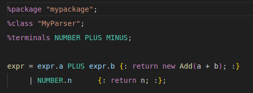
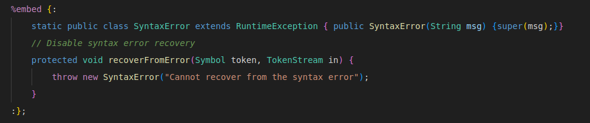

# VsBeaver README

Basic syntax highlighting for Beaver - a LALR Parser Generator.

## Features

Highlights keywords such as %terminal, and terminal tokens making it easier to debug code which would otherwise easily pass as a typo.

Also includes java syntax highlighting inside of %embed blocks and inside of {: :} blocks.

## Extension Settings

None for now.

## Known Issues & Further improvements.

Making an entire LSP with name analysis would be really nice to further help with debugging since small typos can still pass, without any warnings of used names.
To connect the terminal tokens with a jflex file, or %typeof declarations with .ast files would also be amazing.
### 0.0.1

Initial release of VsBeaver